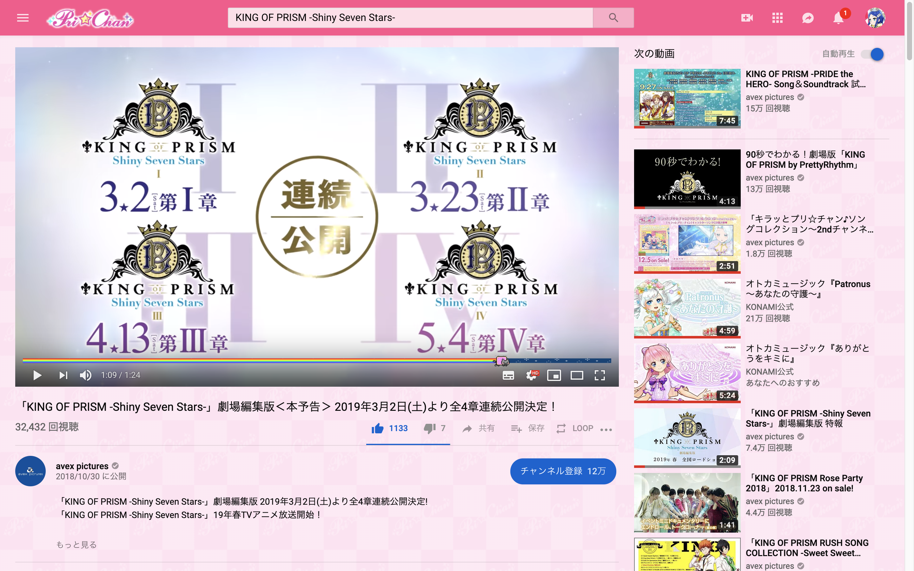
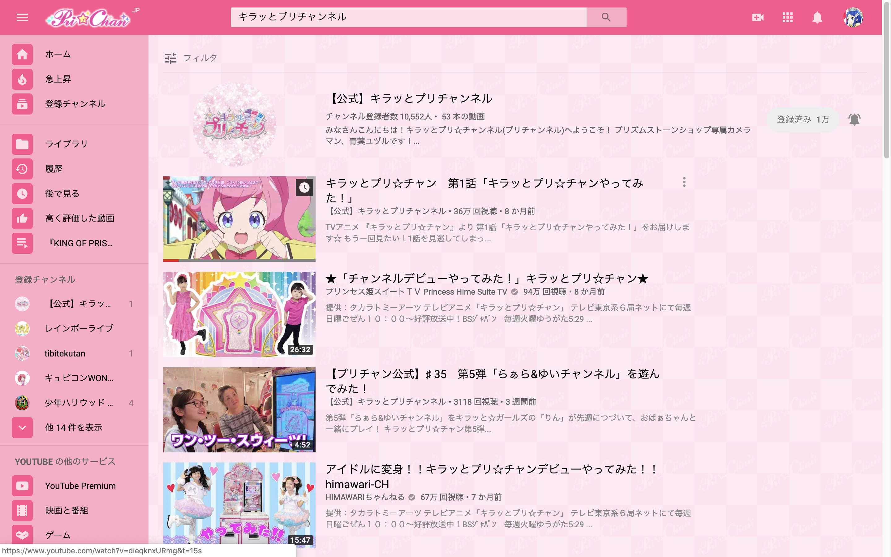
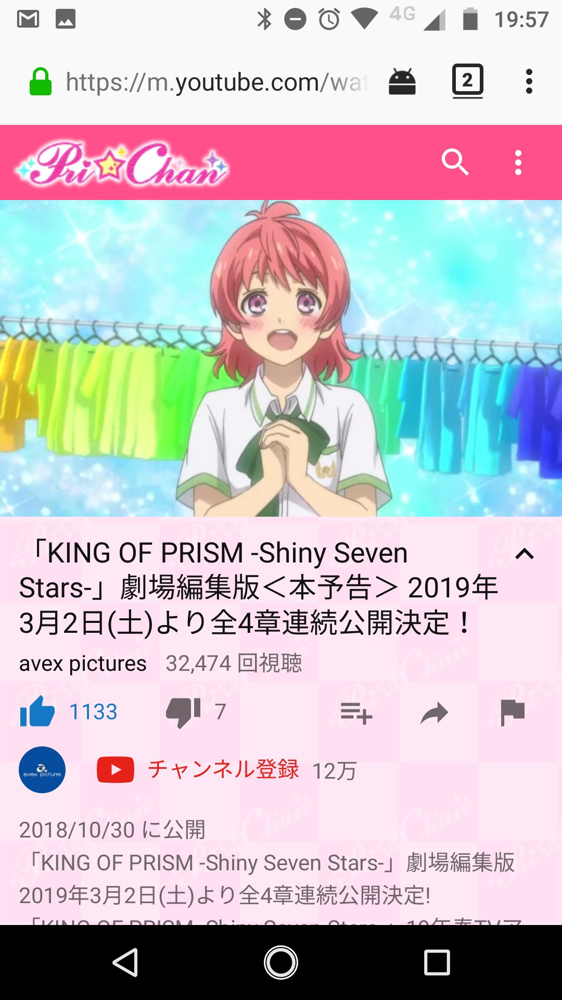

#### [English](#en)

# youtube-prichan-stylesheet

YouTube をプリ☆チャンにプリティーリメイクするスタイルシートです。

*※ヘッダカラーはみらいちゃんのリボンの色です。🎀✨*

## スタイルのインストール方法

1. Stylus というブラウザの拡張機能をインストールします。(stylish ではなく Stylus を使用してください。) Stylus は、下のリンクからダウンロードできます。
   * [Stylus - Chrome Web Store](https://chrome.google.com/webstore/detail/stylus/clngdbkpkpeebahjckkjfobafhncgmne)
   * [Stylus – Get this Extension for 🦊 Firefox (ja)](https://addons.mozilla.org/ja/firefox/addon/styl-us)
2. Stylus をインストール後、[スタイルの公開ページ](https://userstyles.org/styles/167470/kiratto-prichan)を開くと、「Install Style (スタイルをインストールする)」という青いボタンが現れるので、クリックしてインストールします。
3. [YouTube](https://www.youtube.com) を開けば、プリ☆チャンになっているはずです！
### ライセンス

- [GNU GPLv3](./LICENSE)

### スクリーンショット

#### Video Page

#### Seach Result Page

#### m.youtube.com on Google Chrome for macOS

#### m.youtube.com on Firefox for Android

---

# youtube-prichan-stylesheet

This is a stylesheet to change YouTube to Pri☆Chan.

*Hint: The header color is the color of Mirai's ribbon.🎀✨*

## How to install
1. Install the browser extension, Stylus. (You must use Stylus not stylish.) You can download Stylus from below links.
   * [Stylus - Chrome Web Store](https://chrome.google.com/webstore/detail/stylus/clngdbkpkpeebahjckkjfobafhncgmne)
   * [Stylus – Get this Extension for 🦊 Firefox (ja)](https://addons.mozilla.org/ja/firefox/addon/styl-us)
2. Open [stylesheet publish page](https://userstyles.org/styles/167470/kiratto-prichan), then you will see the blue button "Install Style". Then, click it to install this style.
3. You should be able to go to Pri☆Chan here: <a href="https://www.youtube.com/">YouTube</a>!

### License

- [GNU GPLv3](./LICENSE)