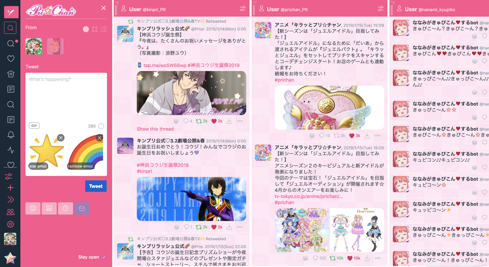

**[English](#en)**

# prichan-stylesheet

いろいろなウェブサイトをプリ☆チャンにプリティーリメイクするスタイルシートです。

*※テーマカラーはみらいちゃんのリボンの色です。🎀✨*

## 対応サイト

- [YouTube](https://youtube.com/)
- [YouTube Music](https://music.youtube.com/)
- [Twitter](https://twitter.com/)
- [TweetDeck](https://tweetdeck.twitter.com/)

## スタイルのインストール方法

1. Stylus というブラウザの拡張機能をインストールします。(stylish ではなく Stylus を使用してください。) Stylus は、下のリンクからダウンロードできます。
   * [Stylus - Chrome Web Store](https://chrome.google.com/webstore/detail/stylus/clngdbkpkpeebahjckkjfobafhncgmne)
   * [Stylus – Get this Extension for 🦊 Firefox (ja)](https://addons.mozilla.org/ja/firefox/addon/styl-us)
2. Stylus をインストール後、[スタイルの公開ページ](https://userstyles.world/style/394/kiratto-prichan)を開くと、「Install Style (スタイルをインストールする)」という青いボタンが現れるので、クリックしてインストールします。
3. スタイルが正しくインストールされていれば、[YouTube](https://www.youtube.com) などを開けば、プリ☆チャンになっているはずです！

## ライセンス

- [GNU GPLv3](./LICENSE) (ただし、スクリーンショット画像を除く)

## スクリーンショット

### YouTube

#### Video Page

#### Seach Result Page

#### m.youtube.com on Google Chrome for macOS

#### m.youtube.com on Firefox for Android

### Twitter

### TweetDeck

---

# prichan-stylesheet

A stylesheet to change several web site to Pri☆Chan.

*Hint: The primary color is the one of Mirai's ribbon.🎀✨*

## Support web site

- [YouTube](https://youtube.com/)
- [YouTube Music](https://music.youtube.com/)
- [Twitter](https://twitter.com/)
- [TweetDeck](https://tweetdeck.twitter.com/)

## How to install
1. Install the browser extension, Stylus. (You must use Stylus not stylish.) You can download Stylus from below links.
   * [Stylus - Chrome Web Store](https://chrome.google.com/webstore/detail/stylus/clngdbkpkpeebahjckkjfobafhncgmne)
   * [Stylus – Get this Extension for 🦊 Firefox (ja)](https://addons.mozilla.org/ja/firefox/addon/styl-us)
2. Open [stylesheet publish page](https://userstyles.world/style/394/kiratto-prichan), then you will see the blue button "Install Style". Then, click it to install this style.
3. You should be able to go to Pri☆Chan here: <a href="https://www.youtube.com/">YouTube</a> or <a href="https://twitter.com/">Twitter</a>!

## License

- [GNU GPLv3](./LICENSE) (Except for screenshots)
